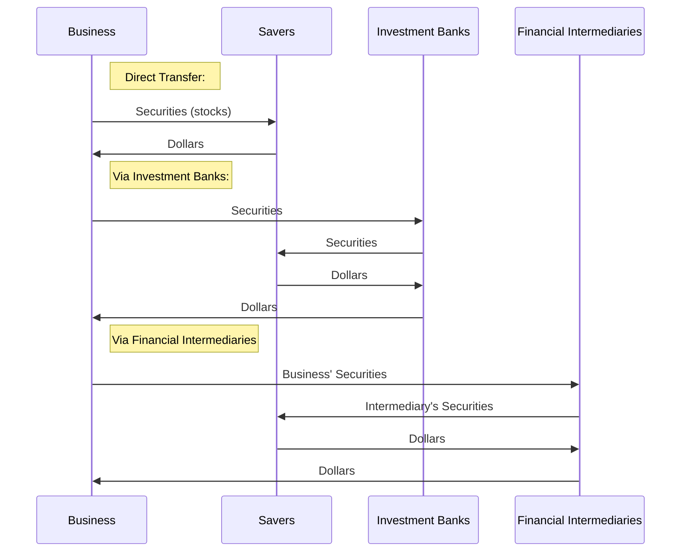

# Financial Markets and Institutions, Financial Statements, Cash Flow, Taxes, and Interest Rates

In general, companies can raise capital in two main forms:
* Debt
* Equity
For this capital, borrowers must pay interest to lenders, which is the **Cost of the Loan**.
Similarly, **equity investors** expect to receive **dividends** and **capital gains**.

## Financial Markets and Institutions
Some companies have extra cash when their income exceeds their expenditure.
eg. Apple has accumulated cash/cash equivalents such as marketable securities for the last 10 years.
Whereas other companies may need to raise capital when they are looking to expand globally. eg. Netflix must raise capital as it is aiming to expand globally.

### Capital Allocation Process
In a **well-functioning economy**, capital flows efficiently from those who **supply** capital to those who **demand** it.
* **Suppliers of capital** - individuals and institutions with "excess funds."
    - These groups are saving money and looking for a **rate of return** on their investment.
* **Demanders or users of capital** - individuals and institutions who need to raise funds.
    - These groups are willing to pay a **rate of return** on the capital they borrow.

> Direct transfers are used mainly by small firms, and relatively little capital is raised by them.

### Financial Markets

> Reminder: A Market is a venue where goods and services are exchanged. A **financial market** is a place where individuals and organisations wanting to **borrow funds** are brought together with those having a **surplus of funds**.

Since the main two forms of fund are **debt and equity**, a financial market is where **debt instruments** such as bonds, **equity instruments** such as stocks, and other assets are traded

A **bond** is a debt instrument that promises a <ins>fixed dollar amount</ins> for every period

A **stock** is an equity instrument that gives <ins>an uncertain dividend</ins> for every period

Types of Financial Markets:
* **Physical asset markets** are for products such as computers/machines
* **Financial asset markets** deals with **stocks, loans, notes and mortgages**.
* **Primary markets** are the process by which companies obtain **fresh funds**, eg. selling stocks in a market for the first time.
* **Secondary markets** are markets where **extending securities** are traded among investors.
* **Public markets** are where **standardised contracts** are traded on **recognised exchanges**. They are differentiated from **private markets** where contracts are negotiated between two parties.
* **Money Markets** are markets in which funds are borrowed or loaned for a short period (less than 1 year).
* **Capital Markets** are markets where Stocks and intermediate/long-term debts (maturity >1 year) are traded.
> TODO: Read about more Market Types in the textbook

Companies often rely on **Financial Institutions** for capital:
* Commercial Banks
* Investment Banks
* Pension Funds
* Mutual Funds
* Exchange Traded Funds (ETFs)
* Hedge Funds
* Private Equity Companies

### Financial Statements and Taxes
An **annual report** is an indication of how well the company is doing. This includes:
* Basic Financial Statements
* Balance Sheet  
    Provides a snapshot of a firm's **financial position** at one point in time
* Income Statement  
    Summarises a firm's revenues and expenses (over a given period of time)
* Statement of Stockholders' Equity
* Statement of Cash Flows
> TODO: Read about Statement of Stockholders' Equity and Statement of Cash Flows from the textbook.

#### Balance Sheet
| Total Assets | Total Liabilities and Equity |
|-|-|
|Current Assets Cash and equivalents, Accounts receivables, Inventory|Current Liabilities  Accrued wages and taxes, Accounts payable, Short-term borrowings|
|Long-Term (Fixed Assets) Net plant and equipment, Other long-term assets|Long-Term Debt|
||Stockholders' Equity  Common Equity (Common Stock + Retained earnings) must = Total assets - Total Liabilities

    Total Assets = Total Liabilities and Equity

## Determinants of Interest Rate

This is the question of the week.
After going through the lesson, you will be able to answer such questions.
Suppose you are considering two possible investment opportunities:
a 10-year Treasury bond and a 7-year, A-rated corporate bond.

The current real risk-free rate is 4% and inflation is expected to be:
2% per year for the next 2 years,
3% per year for year 3 to year 6,
and 4% thereafter.

The maturity risk premium is estimated by this formula: MRP = 0.2(t-1)%.
The liquidity premium and default risk premium for the corporate bond is estimated to be 0.3% and 0.6% respectively. 

What yield would you predict for each of these two investments?
