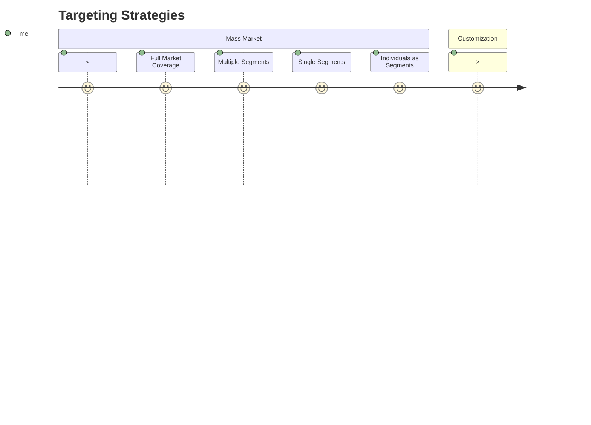

# Targeting
Targeting is the process of **evaluating** each market segment's attractiveness and **selecting** one or more segments to enter.

**Segment Size and Growth**
* Sales Revenue
* Growth Rate
* Expected Profitability

**Structural Factors**
* Types of Competitors
* Number of Competitors
* Buyer and Supplier Power

**Objectives and Resources**
* Long-Term Objectives and Strategy
* Skill and Resources Required

**Size of Segments** and **Number of Segments**

## Choosing a Targeting Strategy
All of these variables should be considered in selecting a suitable targeting strategy for a business:

**Company Resources**  

**Product Variability**  
Affects the amount of ecomonies of scale based on the level of variability in targeting each segment

**Market Variability**  
A highly varied market suggests that there are many segments and that it would be difficult to target all of them (and the converse is true where targeting the mass market is possible).

**Product Life-Cycle Stage**  
Often retrospective and does not reflect the current state of the product. Not recommended to use.

**Competitor's Marketing Strategies**

### Socially Responsible Target Marketing
Target marketing may sometimes result in harm to a target audience, and any potential issues should be considered in marketing to a segment of customers.

**Concern for Vulnerable and Disadvantaged Segments**

**Benefits Customers with Special Needs**  
This group is difficult to monetise without sponsorships

**Hypertargeting can Benefit and Harm Consumers**  
eg. Google's hypertargeted ads could be an invasion of privacy and be undesirable for consumers

## Positioning and Differentiation
**Positioning** is arranging a product to occupy a **clear, distinctive, and desirable place** relative to competing products of the target consumers. 

**Perceptual positioning maps** can show consumer perceptions of their brands versus competing products on **important buying dimensions**.

  

**Differentiation** is creating **superior customer value** with its marketing offering to <ins> support its positioning. </ins>

#### Alternative Model
1. Postioning (Strategising), securing **brand integrity**
2. Differentiation (Developing a core tactic), building a **brand image**
3. Creation of a brand (As an indication of value), creating a **brand identity**

### Developing a Positioning Statement
To \_\_<ins>(target segment and need)</ins>\_\_ our \_\_<ins>(brand)</ins>\_\_ is \_\_<ins>(concept)</ins>\_\_ that \_\_<ins>(point of difference)</ins>\_\_.
