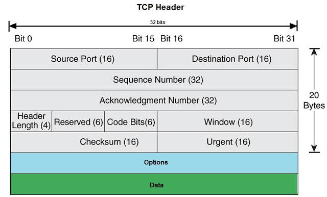

# Internet Basics
* telnet - HTTP connection
* traceroute - ICMP trace of routers
* dig - DNS query
* nslookup - DNS query
* ping - ICMP
* curl - HTTP requests

## Sources of Packet Delay
1. $d_{proc}$ processing delay
    * Check bit error
    * Determine output link
    * < msec
2. $d_{queue}$ queueing delay
    * wait time
    * congestion level
3. $d_{trans}$ Transmission delay
    * time for packet to be sent out (usual stated speed)
    * L (packet length), R (link bandwidth), then L/R
4. $d_{prop}$ Propagation delay
    * time for packet to reach other end
    * d (length of link), s (propagation speed), then d/s
    * s ~= 2*10^8m/sec
5. Throughput: bits transmitted per unit time
    * for end-to-end communication, whereas bandwidth is for a specific link

## Internet Layers
1. Application
2. Transport: Process to Process
3. Network: Host to Host (Transport + Network are internet layer)
4. Link: Device to Device
5. Physical

## Application Layer
Protocols: Regulate **format** and **order** of messages exchanged

Objectives
1. Data loss (Loss tolerance)
2. Timing (low ping, streaming/ gaming)
3. Throughput (Bandwidth)
4. Security

### Application Layer Protocols
1. Type of message
2. Rules of when and how to send
3. Syntax
4. Semantics
5. Open protocols
    * Defined in RFCs (Request for Comments)
    * Allows interoperability (anyone can use them)

### Internet Protocol
1. IP Address (IPv4: 32 bit, IPv6: 128 bit)
2. Port number (16 bit, 1-1023 are reserved, 65535 max)
    * Internet authority IANA assigns port numbers (DHCP: 68 > 67)

#### HTTP Protocol
* Uses TCP (Standard port: 80)
* Round-Trip Time: RTT, time for a packet to travel to and fro
* HTTP 1.1:
    * Persistent connections instead of multiple connections
    * Pipelining (request multiple at once)
    * Multiplexing: Any order can be returned
* HTTP 3:
    * Uses UDP cos they're based

<table>
  <tr>
    <td> Http Request: </td>
    <td> Http Response: </td>
  </tr>
  <tr>
    <td><ol>
      <li>method path version (Request Line)</li>
      <li>headers: Values</li>
      <li>\r\n</li>
      <li>body</li>
    </ol></td>
    <td><ol>
      <li>version code description</li>
      <li>headers: values</li>
      <li>\r\n</li>
      <li>body</li>
    </ol></td>
  </tr>
</table>

Important Codes
Code | Meaning
-|-
200|OK
301| Moved Permanently
304| Not Modified
403| Forbidden
404| Not Found
500| Internal Server Error

### Addressing
DNS: Domain Name System
* Relies on DNS Resource Record, Entry types: 
    * A(address), HostName, IP address 
    * NS(name server), Domain, Hostname of authoritative name server
    * CNAME(canonical name), alias, real name
    * MX(mail exchange), domain, name of mail server
* Contains TTL (Time to Live): refresh cooldown (revalidate)

DNS Servers
* Top-Level domain (TLD) servers:
    * responsible for .com, .org, etc.
    * and all countries
* Authoritative servers:
    * Organisation's own DNS servers
    * Provides authoritative hostname to IP mappings for named hosts (subdomains)
* Local DNS server (Default name server)
    * The ISP
* Done over UDP:53

### Security Issues
* DNS Hijacking (MITM): Compromise name servers
* DNS Tunneling (VPN): Bypassing firewall
* DNS Poisoning/ Cache Poisoning

### Sockets (Ports)
* Abstraction interface between processes and transport layer protocols
    * Present in high-level programming languates
    * Conceptual mailbox
    * Uses API calls
* Sender IP address + Port is used to **locate** processes
* Usually stores hostname instead of numerical IP address

TCP & UDP Sockets
* TCP socket (stream socket)
* UDP socket (datagram socket)

## Transport Layer (RDT, TCP & UDP)
* Process to process communication
* Packet switches (routers): only check dest. IP

### Datagram/ Segments
* $H_t$ Source and dest port (TCP)
* Each IP datagram contains 1 **transport layer segment**
    * $H_n$ source and dest IP addresses

datagram (IP) | segment (TCP) | message
-|-|-
$H_n$|$H_t$|msg

#### RDT Model
Issues Addressed
* Corrupted (Error)
* Dropped (Loss)
* Re-ordered
* Delayed

RDT 2.0: Bit Errors
    * Checksum
    * ACK & NACK
* RDT 2.1: ACK/ NACK corruption
    * Sequence number on send (1/0)
    * RDT 2.2: NAK-free, ACK has last received number
* RDT 3.0: Loss/ Delay (Stop & Wait)
    * Timeout -> Retransmit
    * Double ACK -> ignore
    * Problem: Utilization is low
    * $U_{sender} = \frac{d_{trans}}{d_{trans} + RTT}$
* Pipelining
    * $\frac{n\times d_{trans}}{d_{trans}+RTT}$
    * Number of sequence numbers must be increased
    * Buffer at sender/ receiver

- |Go-Back-N|Selective Repeat
-|-|-
#unACKed | N | N
ACK | cumulative | selective
out-of-order | discarded | buffered
timer | oldest| each
retransmit | all | one

## UDP (User Datagram Protocol)
* Datagram abstraction
* Single socket
* Packet contains:
    * Recipient (dest ip, port)
    * Return (source ip, port)

#### Algorithm
* Add port number
* Add checksum
* Used by streamers (loss tolerant, rate sensitive)

UDP header
1-16|17-32
-|-
source port | dest port
length|checksum

CRC: 1's complement of sum of 16 bit integers from segment

#### Benefits
* No connection setup
* No connection state
* Tiny header
* No congestion control (can spam)

## TCP (Transport Control Protocol)
* Reliable in-order byte stream
* Multiple Sockets
    * Default welcome/ listening socket
    * Forked sockets per connection, identified by (srcIPAddr, srcPort, destIPAddr, destPort)
* Connection oriented
* Flow controlled (Prevents overflow of buffer)
* Congestion controlled (Prevents network congestion)
* Reliable (Guarantees order of bytes, BUT no guarantees on throughput, delay)
* Receiver directs segment to appropriate socket
* Full duplex

> Official specs don't specify out of order handling

> Maximum Segment Size (MSS): derived from link-layer's maximum transmission unit (MTU)
> Maximum Transmission Unit (MTU): includes headers

#### Header
   
* offset (size of header in bits / 32)
* ACK flag (whether ack num is used or not)
* SYN flag (for setting up connection)
* FIN flag (for closing connection)
* Receive window (buffer)
* Options (if offset > 5)

> Seq num between client and server can be diff, ie seq and ack are for different streams in same packet 

#### Algorithm (Baby)
Sender
1. create TCP segment with nextSeqNum
2. Start timer
3. pass segment to IP
4. nextSeqNum += length(data)

* if timeout, retransmit unacked segment and restart timer
* if ack with num y, set offset sendBase = y
    * if some segments still unACKed, start timer
    * Fast Retransmission: if happens 3 times, resend immediately

Receiver
* if in order
    * if already acked
        * wait 500ms for next segment
        * send ACK if no segment
    * else send cumulative ACK immediately
* if out of order (gap created), send duplicate ACK of expected immediately
* if fills gap, send cumulative ACK immediately
    
> Retransmission Time Out (RTO) value depends on estimated RTT, should be larger  

#### Connection Closing
* Send with FIN bit
* Can still receive (only sending connection closed),  must still send ACK

Issues
* SYN flooding by spamming SYN
* SYN/ACK flooding (sabotage some dude by using his return address)

Estimated Moving Average (EWMA) to determine RTO (timeout): 
* $RTT_\epsilon = (1-\alpha) * RTT_\epsilon + \alpha * RTT_s$  
    * $\alpha$ typically 1/8
* $RTT_{dev} = (1-\beta) * RTT_{dev} + B * |RTT_s - RTT_\epsilon|$
    * $\beta usually 1/4$
* $RTO = RTT\epsilon + 4*RTT_{dev}$

## Network Layer
   

### IP Address, Forwarding Table (Data Plane)
* Globally unique (Assignable with Dynamic Host Config Protocol)
* 32 bit identifier for an **interface**
* Uses switching fabric (nanosecond timeframe)
* Hardware: Ternary content addressable memories (TCAMs), works in 1 clock cycle

Forwarding Table: Contains Destination/ Next Hop, Interface

### Routing (Control Plane)
**Automated way** of obtaining forwarding table
* Run by routing processor (millisecond timeframe)

Current Bellman Ford Protocol: Sends changes only, better than RIP  
Internet: Optimised Intra-AS (Autonomous System) routing vs Policy-based Inter-AS between ASs with BGP

#### Link State Algorithms
Examples: OSPF, ISIS
* Uses dijkstra's
* Complete knowledge
* Periodic broadcasts of link costs

#### Fragmentation
* Same ID, different offset, flag 1 until last one

## Link Layer
Main Services: Framing, Link access control  
Other Services: Error detection, correction, reliability (not dropped)  
Implemented on NIC (Network Interface Card)

#### Access Control
* Random Access (No order, recover from collision)
* Take Turns (Token Passing)
* Channel Partitioning (Staggered time slots, TDMA)

Desired properties: Collision free, Efficient (Max R), Fair (Average rate), Decentralized  
Out-of-band channel signalling cannot exist

Protocol:
* Slotted ALOHA: Divide nodes into L/R, retransmit if fail with probability p
    * Collisions, not efficient with multiple, fair, decentralized
* Unslotted ALOHA: No slots
    * Double collisions, efficient
* CSMA: Sense if idle, no fixed size
    * Collisions still possible
* CSMA/CD: Shut up if noise (Declare jamming signal)
    * Still possible, Efficient, Fair, Decentralized
    * 2^n probability interval after n collisions
    * Minimum frame size so that collisions can be detected ($2max(D_{prop})\leq d_{trans}$, by IEEE usually 512 bit times)

#### Local Area Network (LAN)
802.3 Ethernet Standards: MAC protocol and frame format constant
   
* Max size: Link MTU
* Preamble: AA followed by AB to synchronize clocks
* Interframe gap, no length required
* Switch table: MAC, interface, Time To Live
