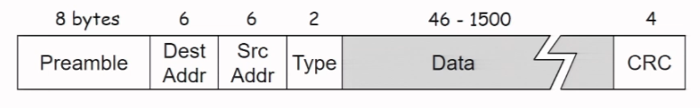

### Link Layer
Main Services: Framing, Link access control

Other Services: Error detection, correction, reliability (not dropped)

Implemented on NIC (Network Interface Card)

#### Access Control
* Random Access (No order, recover from collision)
* Take Turns (Token Passing)
* Channel Partitioning (Staggered time slots, TDMA)

Desired properties: Collision free, Efficient (Max R), Fair (Average rate), Decentralized

Out-of-band channel signalling cannot exist

Protocol:
* Slotted ALOHA: Divide nodes into L/R, retransmit if fail with probability p
    * Collisions, not efficient with multiple, fair, decentralized
* Unslotted ALOHA: No slots
    * Double collisions, efficient
* CSMA: Sense if idle, no fixed size
    * Collisions still possible
* CSMA/CD: Shut up if noise (Declare jamming signal)
    * Still possible, Efficient, Fair, Decentralized
    * 2^n probability interval after n collisions
    * Minimum frame size so that collisions can be detected ($2max(D_{prop})\leq d_{trans}$, by IEEE usually 512 bit times)

#### Local Area Network (LAN)
802.3 Ethernet Standards: MAC protocol and frame format constant
   
* Max size: Link MTU
* Preamble: AA followed by AB to synchronize clocks
* Interframe gap, no length required

#### Topology
Ethernet Switch vs Hub
* Dedicated, direct connections (Star topology)
* No collisions, store and (selectively) forward, works on frames, uses buffers for full duplex
* Hosts unaware of presence of switches
* Builds Switch table: MAC, interface, Time To Live
* Self learning
