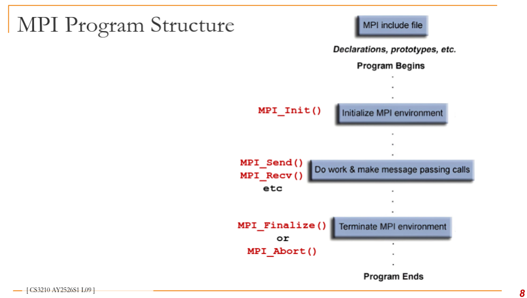
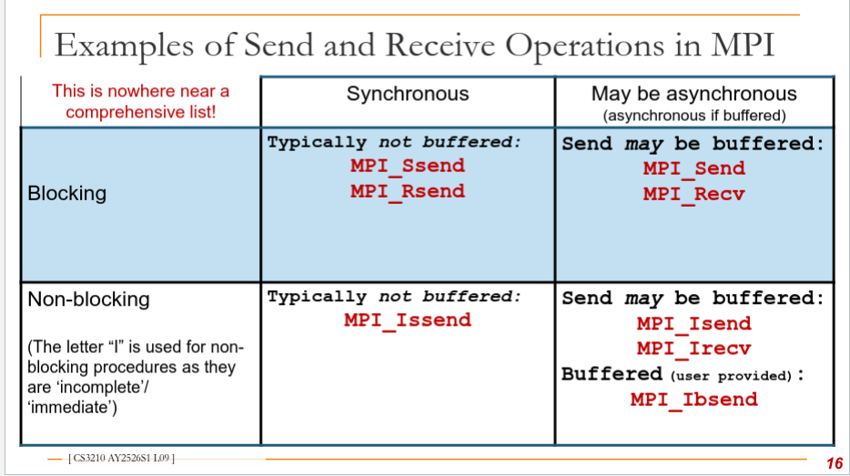
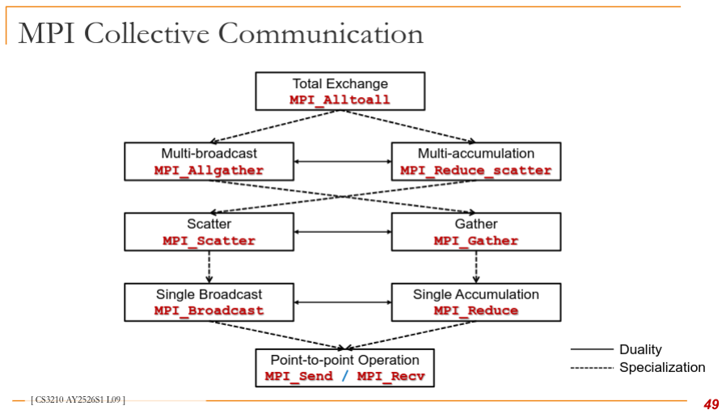
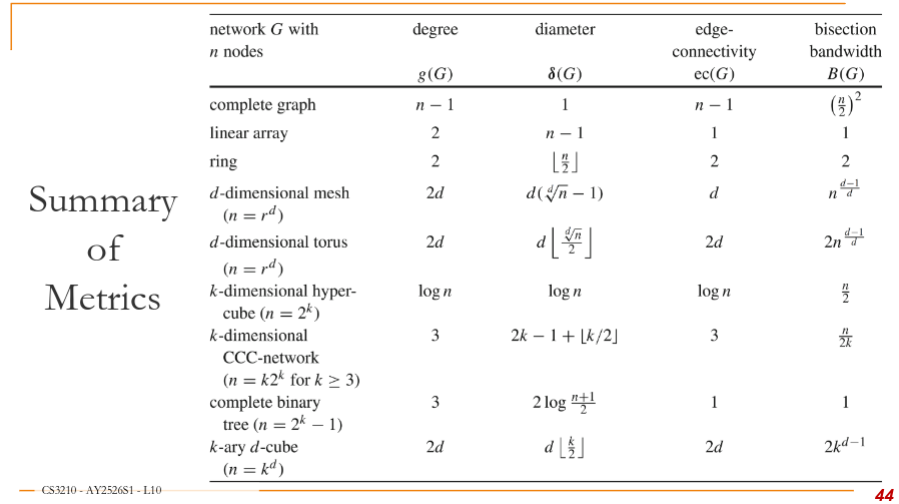

## Intro
PU - Processing Unit
Scheduling - Assignment of tasks to processes/ threads
Mapping - Assignment of processes/ threads to physical cores/ processors
Concurrency - Separate execution
Parallelism - Simultaneous execution

Parallel Programming Challenges
* Granularity
* Locality
* Load balance
* Coordination & synchronization
* Debugging
* Performance modeling / monitoring

IPC (Inter-process Communication) Solutions
* Shared memory
    * Need to protect access when reading/ writing with locks
* Message passing
    * Blocking & non-blocking
    * Synchronous & asynchronous
* Unix specific
    * Pipes & Signal

Process Interaction with OS
* Exceptions
    * Occurs due to program
    * Synchronous -> Exception handler
* Interrupts
    * Occurs independently of program
    * Interrupt handler

Processes (Fork) vs Threads
* Processes
    * New processes have overhead of system calls + Copying of data structs
    * Communication is costly as it goes through OS
* Threads (each thread is sequential)
    * Shared memory architecture: Code data files shared, registers/stack local
    * Generation is faster
    * Can be assigned to run on different cores

User level vs Kernel level
* User level
    * Managed by thread library, OS has no awareness
    * Switching is fast, but no parallelism + OS cannot switch if thread executes blocking I/O
* Kernel Level
    * Managed by OS, efficiently uses cores in multicore system
* Many-to-One: Thread library solely responsible, operates on one thread
* One to One: No library scheduler, OS responsible
* Many to Many: Library scheduler assigns to kernel threads
* Runtime stack of a thread exists **iff** it is active

Conditions for deadlock (All 4 must be present)
* Mutual exclusion - one resource held in non sharable mode
* Hold and wait - Process holding one resource, waiting for another
* No pre-emption - Resources cannot be pre-empted (critical sections aborted externally)
* Circular wait - Set of processes that wait on each other

Dealing with deadlock
* Ignore it
* Prevention - make it impossible
* Avoidance - control allocation of resources
* Detection & recovery - look for cycle

Classic problems:
* Producer Consumer
    * Infinite buffer, finite buffer
* Readers Writers
* Dining philosophers
* Barbershop


Problems with spinlocks
* Wasteful (no progress)
* Lock holder must give up PU by calling yield/ sleep or involuntary context switch

## Architecture
Sources of processor performance gain
* Bit level
    * Word size may mean unit of transfer, mem address space capacity, int size, float size
    * 16 bit (8086, 1978), 32 (80386, 1985), 64 (Pentium 4/ Opteron - 2003)
* Instruction level
    * Pipelining (across time) -> split instruction execution into stages, single fetch/decode
        * Independence, bubbles (in pipeline), hazards: data & control flow
        * Speculation
        * Out of order, eg. read after write
        * Has slowed down since 2000s, no further benefit and processor clock rate stops increasing
    * Superscalar (across space)
        * Automatically find independent instructions **from same thread**
        * Dispatch multiple instructions at same time -> Fewer cycles per instruction
        * Structural hazard
* Instruction level
    * SIMD (Mutliple ALUs), helps with superscalar bottlenecked by single ALU
* Thread level
    * Multithreading originally software mechanism
    * Now processor executes threads in parallel
    * SMT -> Hyper threading with 2 execution contexts but one fetch/decode + ALU + data cache
* Processor Level

Flynn's Taxonomy
* SISD
* SIMD (data parallelism): AVX instructions operate on 4x64 bit values, GPGPUs (Not great for branching)
* MISD example: systolic array
* MIMD: Most popular model for multiprocessor
* SIMD + MIMD
    * Streaming multiprocessors (nVidia GPU), warps are SIMD, grid is MIMD


### Shared Memory
* L1 can be separate, then L2 and L3 are shared with other cores
* All cores share common external memory
* Latency: time for mem request to be serviced (in cycles, nsec)
* Bandwidth: rate that system provides to processor (20GB/s)

Pipelined design
* Data elements processed by multiple cores in pipelined way
* Useful if same computation steps applied to long sequence of data, eg routers & GPUs

Network based
* Connected via interconnection network
* Optimising on-chip interconnections (Network on Chip NoC):
    * Enough bandwidth for data transfers between cores
    * Scalable
    * Robust to tolerate failure
    * Efficient energy management
    * Reduce memory access time

Memory Distribution
* Distributed -> Every node is independent
* Shared -> Shared memory provider, program unaware of hardware memory architecture (ensured cache coherence & memory consistency)
    * UMA vs NUMA
    * Cache coherence protocol: CC vs NCC
    * UMA is better for small number of processing units due to contention
    * NUMA: physically distributed memory of all PUs combined to form global shared memory
        * each memory unit separate from PUs
    * ccNUMA: each PU has cache memory to reduce contention
    * COMA (cache only) each memory block works as cache memory, data migrates dynamically & continuously

Pros/ Cons of Shared Memory Systems
* No need to partition code/ data, or physically move data among processors (communication is efficient)
* BUT special synchronization constructs are required
* AND not scalable due to contention

## Parallelism
* Program dependencies: data dependency, control dependency means that `Work = work required for tasks + overhead of dependencies `
    * Overhead (in range of ms): Cost of starting parallel task, managing/ coordinating inter-processor/ task interactions
* Data parallelism: Partitioning data among PUs, then perform similar operations
    * Common model: SPMD (Single Program Multiple Data), eg scalar product of $x\cdot y$
* Task (functional) parallelism: Parition tasks among PUs

Models of Coordination
* Shared address space (Data parallel)
    * Costly to scale due to contention
    * Requires hardware support
    * Data parallel: Mapping same function onto large collection of data
        * Functional: side effect free
        * No communication means can be scheduled in parallel
        * Stream model
        * No longer enforced strictly by modern performance oriented data-parallel, eg CUDA, OpenCL, ISPC
* Message Passing: Explicitly sending/ recv messages
    * Matches distributed memory systems
    * Can be implemented on any hardware

### Program Parallelization
* Granularity: Sequence of instructions, sequence of statements, function/ method

Foster's Design Methodology
1. Partition problem
    * Data Centric (Data parallelism): Domain decomposition 
    * Computation Centric (Task parallelism): Functional decomposition
    * Rule: At least 10x more primitive tasks than cores in target computer
    * Minimize redundant computations & redundant data storage
    * Primitive tasks roughly of same size
    * Number of tasks increases with problem size
2. Communication: Provide data required by tasks (cost of parallelism)
    * Local communication (data from neighbours), then create channels illustrating data flow
    * Global communication (tasks contribute data to perform computation), then dont make channels early in design
    * Rule: Ideally distribute + overlap computation/ communication
    * Balance communication among tasks
    * Communicate with small group of neighbors
    * Perform communication in parallel
    * Overlap computation with communication
3. Agglomeration: Decrease communication/ development costs, while maintaining flexibility
    * Combine tasks into larger tasks still >= number of cores
    * Improve performance (cost of task creation + communication)
    * Maintain scalability of program
    * Simplify programming
    * Rule: Locality of parallel algo should increase
    * Number of tasks should still increase with problem size
    * Suitable number for target systems
    * Tradeoff between agglomeration & code modification costs is reasonable
4. Mapping: Map tasks to PUs, with goal of minimising total execution time
    * Maximise processor utilization (place tasks on different PUs), but minimise inter-processor communication (place tasks that communicate frequently on same PUs)
    * Rules: NP hard in general
    * Designs based on one task per core vs multiple per core
    * Static vs dynamic task allocation:
    * Dynamic allocator should not bottleneck
    * Static chosen if ratio of tasks to cores is 10: 1

Automatic Parallelization
* Done by parallelizing compilers (Kinda suck)
    * Difficult to analyze dependencies with pointers/ indirect addressing
    * Execution time of functions/ loops with unknown bounds are difficult to predict
    * Opaque hardware behaviour + Complex memory hierarchies

Functional Programming Languages
* Describe computation as evaluation of mathematical functions without side effects
* Advantages: New language constructs not necessary
* Challenge: Extracting parallelism at right level of recursion

### Common Programming Patterns
* Fork-Join
* Parbegin-Parend (OpenMP/ compiler directives)
* SPMD, SIMD (AVX/ SSE instruction on Intel)
    * No implicit synchronization
    * Implementation: GPGPU
* Master-Worker (Master-Slave)
    * Master executes main function, assigns work to worker threads
* Task pool
    * Threadnum is fixed, tasks are retrieved from pool by worker threads
    * Access to task pool is synchronized
    * Completed when no more tasks + each thread terminated processing of last task
    * Adaptive, irregular applications (dynamic allocation) 
    * Overhead of thread creation is independent of problem size & number of tasks
    * Disadvantage: should not be used for fine grained tasks due to overhead of retrieval/ insertion
* Producer-consumer
    * Needs synchronization to ensure correct coordination
* Pipelining
    * Stream of data elements flowing through pipeline stages (Stream (functional) parallelism)

## Performance
Possible goals
* Users: reduced response time
* Computer managers: high throughput (average work executed per unit time, jobs/s, transactions/s)

#### Reducing response (wall-clock, latency) time
Understand performance of sequential program
* wall-clock time
* User CPU time (program execution), System CPU time (OS routines), waiting time (I/O + other programs from time sharing)
    * User CPU Time: $Time_{user}(A) = N_{cycle}(A) \cdot Time_{cycle}$ ie. total number of cycles * time per cycle
    * Ends up depending on $N_{instr}(A)$ (architecture & compiler) and $CPI(A)$, average number of CPU cycles for each instruction, (internal organization of CPU, memory system, compiler)
    * Also needs to add $N_{mm\_cycle}(A)$, additional cycles due ot memory access
    * $N_{mm\_cycle}(A) = N_{read\_cycle}(A) + N_{write_cycle}(A)$
* LLC - Last Level Cache
* $MIPS = \frac{N_{instr}(A)}{Time_{user}(A)\cdot 10^6} = \frac{clock\_frequency}{CPI(A)\cdot 10^6}$
    * Meaningless Indicator of Performance as easily manipulated (simple instructions, only considers number of instructions)
* $MFLOPS(A) = \frac{N_{flops}(A)}{Time_{user}(A)\cdot10^6}$
    * Still used to rank t500
    * Different types of floating point operations, only useful for goal of maxmiming throughput of FLOPs

Understand speed of parallel program
* Consists of:
    * Time for executing local computations
    * Exchange of data
    * Synchronization
    * Waiting
* **speedup**: $S_p(n) = \frac{T_{best\_seq}(n)}{T_p(n)}$
    * Theoretically always $\geq 1$
    * In practice, superlinear can occur: if problem fits in cache and one thread pulls data into L3 cache that another thread uses
* **Cost** of program on $p$ PUs: $C_p(n) = p\cdot T_p(n)$
    * Total amount of work, ie processor-runtime product
    * Program is **cost optimal** if executes **same total operations** as fastest sequential program
* **Efficiency**: $E_p(n) = \frac{T_{best\_seq}(n)}{C_p(n)} = \frac{S_p(n)}{p}$
    * Ideal speedup is 1

Difficulties:
* Best sequential algo may not be known
* Exists algo with optimum asymptotic execution time, but other algos are faster in practice
* Complex implementation for fastest algo

#### Amdahl's Law
Speedup of parallel execution is limited by the fraction of the algorithm that cannot be parallelized (f).

$S_p(n) = \frac{1}{f + \frac{1-f}{p}} \leq\frac{1}{f}$

* f is the sequential fraction/ fixed-workload performance
* Means that manufacturers are discouraged from making large parallel computers
* More research attention was shifted towards developing parallelizing compilers to reduce sequential fraction

Gustaffson's law: f is not constant, larger problem sizes means smaller f means more parallelizable
* Larger problems have insignificant f  since overhead doesnt scale much with problem size
* Many problems are limited by maximum runtime, not problem size, eg weather simulation
    * ie. parallelization is still great as we keep increasing problem size but need similar runtime

Assumptions by both laws
* Amdahl: f is fixed
* Gustafson: fraction is 0 if problem is large enough
* Parallelizable parts are perfectly parallelizable with no overhead
* Identical processors
* No communication delay
* Memory is not bottleneck

#### Scaling Constraints
* Application-oriented scaling properties (deciding on problem size for unique problem)
* Resource-oriented scaling properties
    * Problem constrained (PC) try to solve faster with fixed size
    * Time constrained (TC): completing more work in fixed time
    * Memory constrained (MC): largest problem possible without memory overflow
* Arithmetic intensity: amount of computation (instructions) / amount of communication (bytes)
    * If numerator is execution time, then ratio gives bandwidth requirement
    * Can be flipped for comm to comp ratio
    * High intensity is required to efficiently utilize modern processors as ratio of compute capability to bandwidth is high

#### Temporal Locality, Cache lines
* Tree structure has less contention, higher latency
* Exploit sharing: locate tasks that operate on same data and schedule on same processor
* Avoid sharing cache lines among tasks running on different cores
* Use padding to avoid cache line sharing
* Allocate work to take advantage of prefetching

### Performance Analysis
* Set goals (response time, throughput, speedup)
* Determine evaluation approach
* Try simplest solution first, then determine what limits performance (computation, memory bandwidth/ latency, synchronization), identify bottleneck
    * Instruction rate limited -> increases linearly with operation count as math is added
    * Memory bottleneck -> Remove math, but load same data
    * Locality of data acces -> change all array accesses to first element
    * Sync overhead -> remove all atomic operations/ locks

## GPGPUs
### Architecture
* Multiple Streaming Multiprocessors (SMs)
    * Memory & Cache
    * Connecting interface (PCIE, HBM, NVLink)
* SM has multiple compute cores
    * Memories (registers, L1/ L2 cache, shared memory)
    * Logic for thread/ instruction management
* Massive register count: ~255 per thread vs 16/32 per thread in CPU, meaning instant context switch with no need for main memory access
* Compute Capability indicates features, internal architecture

### CUDA
* Compute Unified Device Architecture
* Simple extension to standard C
* Mature software stack (high + low level access)
* Launch batches of threads
* Fully general load/store mem model (CRCW)
* Enable heterogeneous systems (CPU + GPU)

Compilation process
* nvcc outputs CPU code + GPU intermediate assembly code (PTX)
* PTX -> low level NVIDIA SASS code -> binary
* Linking of CPU + GPU code with CUDA libraries

Runtime
* Kernel -> grid ->  blocks -> warps
* Each block assigned to 1 SM for kernel duration (shared memory, atomic operations, can synchronize within block)
* Multiple blocks can reside on an SM, register file is partitioned, shared memory is partitioned
* Block is partitioned into warps and warp is scheduled by warp scheduler for execution
* Warps take turns to execute until all threads of block finish executing
* Warps -> SIMT execution
    * Threads have individual ip and registers

Memory Model
* Every block has shared memory (L1 cache)
    * Divided into equally sized mem models, called banks (total 32)
    * Bank conflict: two addresses of requests fall in bank (has to be serialized)
    * Bank bandwidth: 32 bits/ cycle,  successive 32-bit words assigned to successive banks
* GPU DRAM slow (L2)
    * Global: read/ write
    * Constant: readonly, better for linear access
    * Texture: readonly, better for 2D spatial access
* Unified memory model (automated)

Optimization
1. Optimize mem usage to achieve maximum mem bandwidth
    * Minimise data trf
    * Coalesce global memory access
    * Minimise global memory access w/ shared memory
    * Minimize bank conflicts in shared memory access: strides also suck
    * Host & device trf is slowest -> can even run kernels on GPU that do not have speed up over CPU
    * Batching small transfers into large transfer
    * Page-locked/ pinned memory trf
        * pinned mem is not cached (guaranteed to be in RAM)
        * use zero-copy that allows threads to access host memory
2. Maximise parallel execution
    * Expose data parallelism
    * Map to hardware to increase occupancy (utilization)
        * Warpno > multiprocessor cnt means all SP have at least 1 warp to execute
        * Reduces idling when block syncs
        * Low occupancy -> hiding memory latency is impossible
        * Threads per block should be minimum 64 to avoid bank conflicts, facilitate coalescing
        * Try for several smaller thread blocks rather than 1 large block per multiprocessor
    * `cudaMemcpyAsync()` when possible
    * separate streams to concurrently copy + execute
    * At least 1 thread block must be able to run on an SM or kernel launch fails if more registers are required than are available
    * Avoid multiple contexts per GPU within same CUDA app
3. Optimize instruction usage to achieve max instruction throughput
    * High throughput arithmetic instructions
    * trade precision for speed, single precision floats, avoid division/ modulo, use signed loop counters
    * Avoid branching: Reduce number of instructions/ sync too

## Cache Coherence
Properties
* Program Order
* Write propagation
* Transaction serialization (must be uniform)

Implications
* Increases mem latency in multicore
* Lowers hit rate
* Ping-pong if multiple read & modify on same var
* False sharing if writing to different address on same line

Block & Cache size
* Cache size increases time but reduces misses
* Block size increases replacement time but increases chance of locality hit
* 4-8 words in L1

Policies
* Write through (instant, slow)
* Write back (lazy, fast, invalid entries)
    * Snooping: monitors bus to update cache line status (common for bus)
    * Directory based: status is kept in central location (NUMA)


### Consistency
* Constrains order of mem operations becoming visible to other threads for different mem locations
* Used by compilers to dictate what is allowed
    * W -> R write must commit (observed) before read from Y
    * R -> R etc. 
    * R- > W
    * W -> W
* Reordered to hide latencies, (Systems) OS and compiler developers see it a lot

Sequential Consistency Model (SC)
* Preserves all 4 orderings
* Extension of uniprocessor mem model, results in loss of performance
* Arbitrary interleaving of mem access

#### Relaxed Consistency
* Relax if no data dependencies
* Dependency: if two operations access same mem location
    * R -> W: anti-dependency (WAR)
    * W -> W: output dependency (WAW)
    * W -> R: flow dependency (RAW)
* Hides latencies

#### Write-to-Read
* Allow read on P to be reordered w.r.t. previous write on same PU
* Data dependencies must be preserved
* Cache coherence preserved
* Different timing of return of read defines different models

Types (W->R not ensured)
* Total Store Ordering (TSO) ensures write atomicity: All units observe write at same time
* Processor Consistency (PC) returns write before write is observed by all units

#### Write-to-Write
* Writes can bypass earlier writes to different locations in write buffer
* Allow write miss to overlap & hide latency

Types (no W->R, no W->W)
* Partial Store Ordering (PSO): writes can be reordered, but write atomicity ensured

## MPI
* Blocking -> Resources used in call may be safely reused
* Non-blocking -> Resources may not be safe to use
* Synchronous -> Completes when a matching receive has started to execute ("non-local")
* Buffered -> copies user provided data to internal buffer then returns control, faster than network speed, trades space for time
    * Non buffered means send initiates interrupt at receiver to copy data even before receive()

<br><br> 
<br><br> 
<br><br> 

## Interconnect Topology
* Direct interconnect -> Static, point to point
* Indirect interconnect -> Dynamic, uses switches

Metrics
* Diameter $\sigma /G$: maximum distance between pair of nodes
* Degree g(v): direct neighbour nodes
* Bisection width B(G): minimum number of edges that must be removed to divide network into 2 equal halves
    * Measure of network's capacity in worst case when many nodes are transmitting simultaneously (bottleneck bandwidth)
* Connectivity
    * node connectivity nc(G): minimum number of nodes that must fail to disconnect network
    * Edge connectivity ec(G): min number of edges that must fail
        * Determines number of independent paths between pairs of nodes

<br><br> 

## Indirect interconnect
* Reduces hardware costs, connect different hardware, dynamic configuration

Metrics
* Cost (number of switches/ links), Concurrent connections

Types: 
* Crossbar (nxm switches that go straight or direction change)
* Omega (one unique path for every input to output)
    * log n stages for nxn network
    * n/2 switches per stage
    * uses 2x2 switches (2 inputs, 2 outputs)
    * Connections are regular
    * known as (lg n - 1) dimension omega network

Omega switch topology
* Switch's position: ($\alpha$, i)
    * has edge to two nodes ($\beta$, i+1) where 
    * $\beta = \alpha >> 1, \beta' = \alpha >> 1$ + inversion of lsbit (rightmost bit)

Butterfly switch topology
* Node ($\alpha, i$) connects horizontally and in the i+1th bit to the left (+8, 4, 2, 1)

Baseline network
* Cyclic right shift of last (k-i) bits of $\alpha$, where k is number of bits
* And inversion of LSBit of $\alpha$, then cyclic right shift of last (k-i) bits

### Routing Algorithms
* Path length minimal if always chosen
* Deterministic vs Adaptive (Always choose same? Or take into account network status & avoid congested path, dead nodes)
* XY routing for mesh
* E-Cube Routing for hypercube:
    * Number of bits different in source & target address (hamming distance)
    * Start from MSB to LSB (go to neighbouring node with bit corrected)
    * At most n hops
* XOR-Tag Routing for Omega
    * T = Source ID XOR Dest id
    * At stage-k, go straight if bit k (left to right) is 0

## Energy Efficiency
Dennard scaling -> processors can always fit more transistors per unit area without using more power per unit area (false since 2005-2010)
* Power limits are being reached due to complex cooling requirements, eg. cooling
* Power is stagnant, and single thread performance/ frequency is stuck

Metrics
* Performance per watt (score of benchmark / CPU power)
    * Not constant since processors can operate at different power levels, eg clock freq change
* Performance does not increase linearly with power: Processor voltage is the most significant factor on power & temp

$P_{total} = P_{dynamic} + P_{static}$

$P_{dynamic} = k \times V^2 \times f$

* Static means independent of work done by processor
* f is freq, V is voltage, k is value depending on program complexity & processor hardware

Modern Datacenters
* US frontier: 49k sg households, 24.6 MW peak power
* Fukagu: 60k sg households, 29.9 MW peak power
* GFLOPs-per-watt
* Power Usage Effectiveness: data center energy efficiency -> usage for compute vs total usage

Power Usage Effectiveness (PUE)
* Total facility energy / IT equipment energy = 1 + non IT facility energy / IT equipment energy
* Running large computes reduces PUE, incentivising centers to use more energy
* Measuring fewer overheads -> lower PUE

```
MPI_Send(source, amount, MPI_DOUBLE, rank, 1, MPI_COMM_WORLD);
MPI_Recv(dest, amount, MPI_DOUBLE, rank, 0, MPI_COMM_WORLD);
MPI_Gather(source, amount per source, MPI_DOUBLE, dest, amount per source, MPI_DOUBLE, rank, MPI_COMM_WORLD);
MPI_Scatter(source, amount per dest, MPI_DOUBLE, dest, amount per dest, MPI_DOUBLE, rank, MPI_COMM_WORLD)
MPI_Reduce(source, dest, amount per source, MPI_DOUBLE, MPI_SUM, rank, MPI_COMM_WORLD)
```
