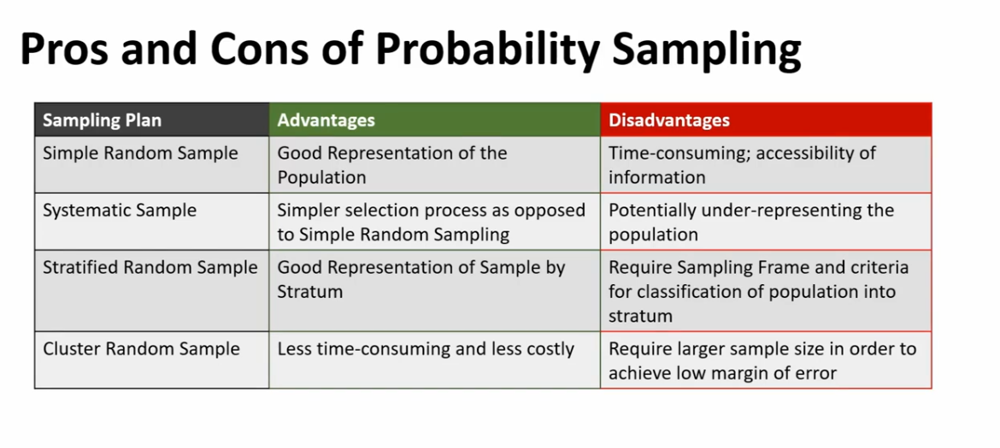

## Definitions
* Population of Interest: Group researcher wishes to draw conclusions about
    * Population Parameter: Numerical fact about population
* Sample: Proportion of population selected
    * Sampling Frame: Source of a sample (Ideally equivalent to population)
        * Subject to issues of insufficient coverage/ redundant data
        * Must be >= target population for **Generalisation criteria**
    * Selection Bias:
        * Imperfect Sampling Frame
        * Non-Probability Sampling
    * Non-Response Bias:
* Estimate: Inference based on info from sample
* Census: Attempt to reach out to whole population
* Sample: Proportion (Cheaper, faster)

## Sampling Types
### Probability Sampling
* Known randomised mechanism
* Probability of sampling may not be the same throughout all units
* Chance is used to eliminate bias

   

#### Simple Random Sampling
* Random selection **without replacement**
* Mechanism: RNG
* Set of units has equal chance
* Results do not change haphazardly between samples

#### Systematic Sampling
* Select a modulo and offset

#### Stratified Random Sampling
* Break into strata of different size
* Simple Random Sampling within stratum

#### Cluster Sampling
* Broken down into similar clusters
* Randomly sample fixed clusters
    * All observations within selected clusters recorded

Disadvantage: High variability if clusters are dissimilar

### Non Probability Sampling
* Non-usage of chance in selection
* Methods are not mutually exclusive

#### Convenience Sampling
* Select based on proximity/ availability
* Potentially high selection bias, non-response bias

#### Volunteer Sampling
* Volunteer-based
* Similar bias issues

## General Sampling Conclusions
* Choose appropriate Sampling Frame
* Use Probability-Sampling Method
* Remove Unwanted Units
* **Generalisability Criteria**:
    * Good Sampling Frame
    * Probability-Based Sampling
    * Large Sample Size
    * Minimize non-response
