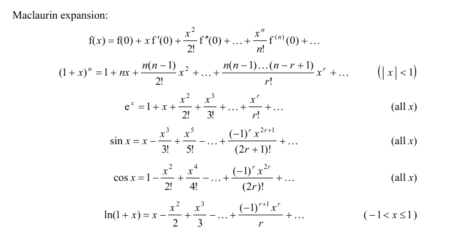
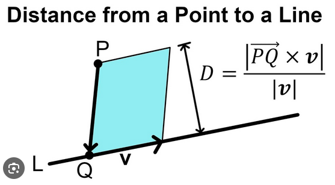
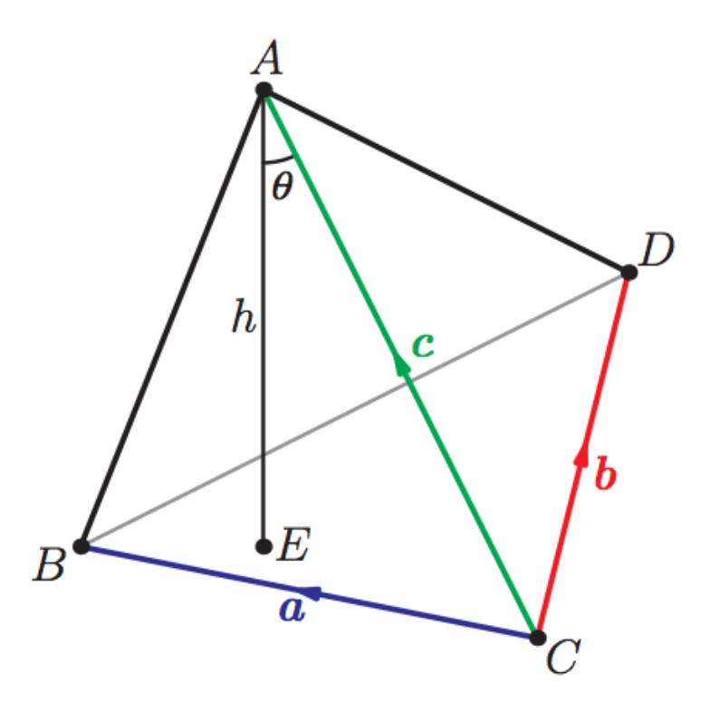
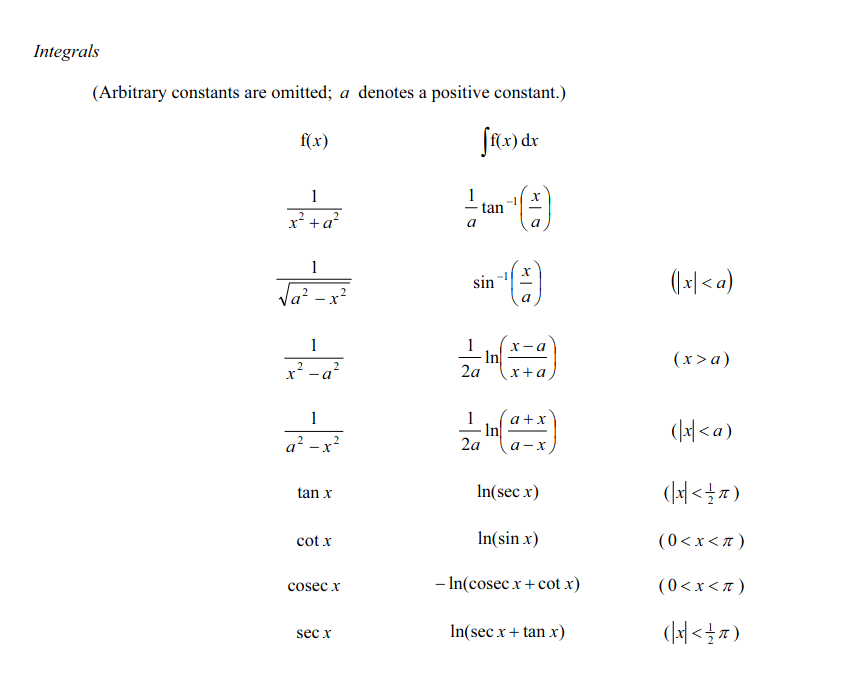
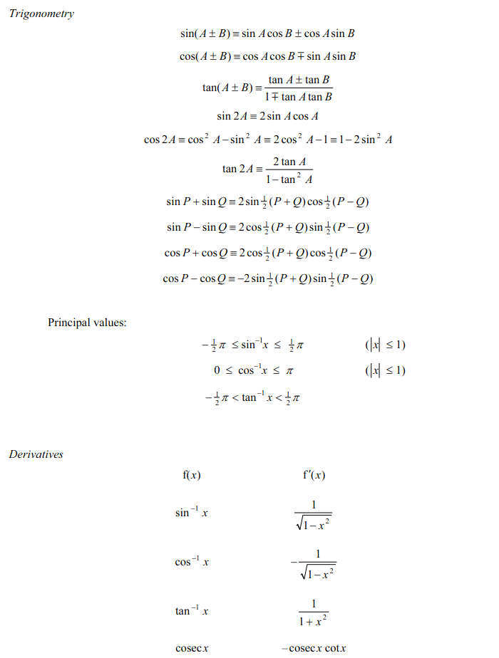

### Integrating Factor

Form:

$\frac{dy(x)}{dt} + p(t)y = g(t)$

Then apply: $e^{\int{p(t)}}$ as integrating Factor

### Power Series

### Vectors

  

* Area of Triangle: $\frac{1}{2}|a\times b|$
* Volume of sphere: $\frac{4}{3}\pi r^3$

  
* Tetrahedron: $\frac{1}{6}|a\times b\cdot c|$
* Cone: $\pi r^3 \frac{h}{3}$

### Calculus
$\frac{d}{dx}\int^{f(x)}{g(t)}dt = \frac{df(x)}{dx}\cdot\frac{d}{df(x)}\int^{f(x)}{g(t)} = \frac{df(x)}{dx}\cdot g(f(x))$

* Length of curve: $\int{\sqrt{1+(\frac{dy}{dx})^2}}dx$
* Second derivative test: $D = f_{xx}f_{yy} - (f_{xy})^2$
    * $D<0$ : saddle point
    * $D<0, f_xx <> 0$ : relative maximum/minimum
* alternating series test (converges to 0, decreasing sequence)
* sum of geometric series: $\frac{a(1-r^n)}{1-r}$
* shell formula: $2\pi r h$

